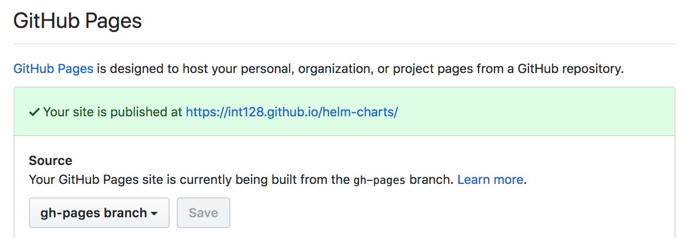

# Helm GitHub Pages [](https://circleci.com/gh/int128/helm-github-pages)

You can publish your [Kubernetes Helm](https://github.com/kubernetes/helm) charts on GitHub Pages.

## Example

Here is my workflow to publish the chart:

```
> git commit
> git push origin master
  ↓ Push
+--------------+
| GitHub       | https://github.com/int128/kubernetes-dashboard-proxy
+--------------+
  ↓ Webhook
+--------------+
| CircleCI     |
+--------------+
  ↓ Push
+--------------+
| GitHub       | https://github.com/int128/helm-charts
+--------------+
  ↓ Publish
+--------------+
| GitHub Pages | https://int128.github.io/helm-charts
+--------------+
```

You can install the chart by the following:

```sh
helm repo add int128 https://int128.github.io/helm-charts
helm repo update
helm install int128/kubernetes-dashboard-proxy
```

## Getting Started

### 1. Create a repository for publishing your charts

Create a new repository with `README.md` on GitHub. Then create `gh-pages` branch as follows:

```sh
git clone https://github.com/USERNAME/helm-charts
cd helm-charts
git checkout -b gh-pages
git push origin gh-pages
```

Make sure that `gh-pages` branch of the repository is published on GitHub Pages.



### 2. Create a chart

Create a new repository with `README.md` on GitHub. Then create a chart as follows:

```sh
git clone https://github.com/USERNAME/hello-world
cd hello-world

# Create a chart
mkdir charts
cd charts
helm create example

# Push the change
git add charts
git commit -m 'Add charts'
git push origin master
```

Now your repository looks like:

```
/README.md
/charts
/charts/example
/charts/example/.helmignore
/charts/example/Chart.yaml
/charts/example/templates
/charts/example/templates/NOTES.txt
/charts/example/templates/_helpers.tpl
/charts/example/templates/deployment.yaml
/charts/example/templates/ingress.yaml
/charts/example/templates/service.yaml
/charts/example/values.yaml
```

### 3. Fork this repository

Fork this repository.
You can access to the script by `https://raw.githubusercontent.com/USERNAME/helm-github-pages/master/publish.sh`.

### 4. Setup CircleCI

Create `.circleci/config.yml` in the repository.

```yaml
version: 2
jobs:
  build:
    docker:
      - image: alpine
    steps:
      - checkout
      - run:
          name: helm-github-pages
          environment:
            - GITHUB_PAGES_REPO: USERNAME/helm-charts
          command: wget -O - https://raw.githubusercontent.com/USERNAME/helm-github-pages/master/publish.sh | sh
```

Push the change.

```sh
git add .circleci/
git commit -m 'Add .circleci'
git push origin master
```

Then open [CircleCI](https://circleci.com) and add the repository.

You must configure a checkout key as follows:

1. Open settings of your repository on CircleCI.
1. Open the *Checkout SSH keys* in the Permissions section.
1. Click the *Create and add user key* button.

Make sure that the build is successfully finished.

### 5. Test the chart

Add the Helm Charts repository.

```sh
helm repo add USERNAME https://USERNAME.github.io/helm-charts
helm repo update
```

Make sure that your chart is available.

```sh
# Show values for the chart
helm inspect USERNAME/example

# Install the chart
helm install USERNAME/example
```

## Configuration

You can set the following environment variables:

Name | Value | Default
-----|-------|--------
`GITHUB_PAGES_REPO` | URL of the repository for publishing | Mandatory
`GITHUB_PAGES_BRANCH` | Branch name for publishing | `gh-pages`
`HELM_CHARTS_SOURCE` | Helm Charts source directory | `./charts`
`HELM_VERSION` | Helm version | `2.8.1`

See also [`.circleci/config.yml`](.circleci/config.yml) in this repository.

## Contribution

This is an open source software licensed under Apache License 2.0.
Feel free to open issues or pull requests.

### How it works

The script assumes that it is running on the Alpine image and CircleCI docker environment.

It does the following steps:

1. Check out the `gh-pages` branch of the repository for publishing.
1. `helm lint` for each chart.
1. `helm package` for each chart.
1. `helm repo index` for all charts.
1. If the master branch is pushed, publish the charts.
